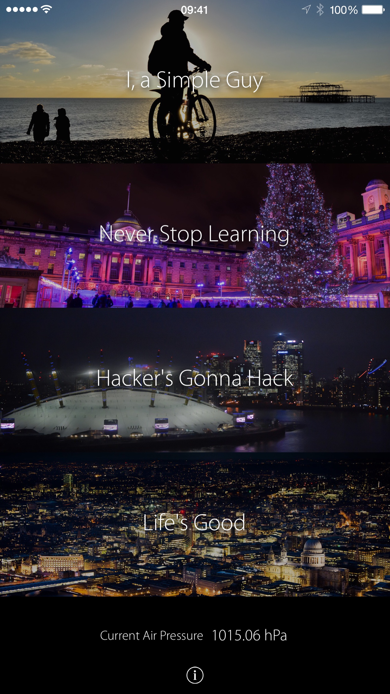

# Clarence-Ji

**Clarence Ji** is the name of an iOS app that was used to apply for Apple Worldwide Developer Conference student scholarship in 2015.
It is not and will not be pushlished on the App Store due to the [App Review Policy](https://developer.apple.com/app-store/review/), however, this app helped me win the scholarship and made me possible to attend the conference.  
The main technical achievement is the use of barometers that were added to iPhone 6 and later models. The theme (bright / dark) changes depending on the readings from barometer.

More details about the app can be found on [Pinterest](https://pinterest.com/clarenceji/clarences-wwdc15-app/)  
Also you can check the live blog for WWDC15 on [my personal website](http://wwdc.clarenceji.net).
